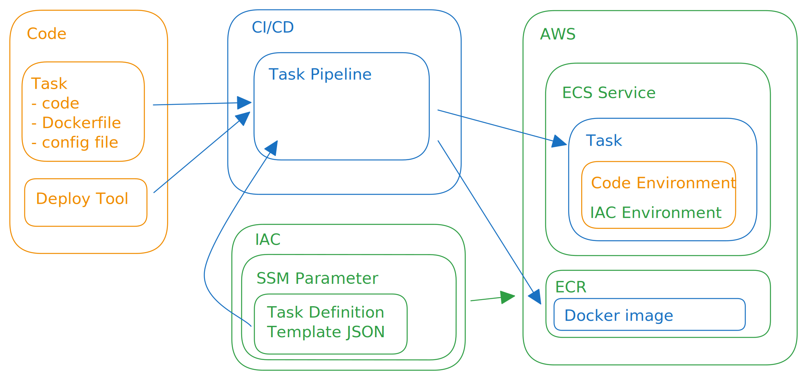

# ECS Deploy CLI

Use this tool to deploy a Docker image to ECR and ECS with CI or manually.

Features:

- Environment and SSM credentials storage conventions
- GitHub Actions pipeline example
- Cross-platform (made with TypeScript/Javascript, external requirements: `git`, `docker`)


Examples:

- [NestJs](./examples/nestjs) Docker and Pipeline

# Usage

```bash
yarn add ecs-deploy-cli@poviolabs/ecs-deploy-cli#v4

# upgrade
yarn up ecs-deploy-cli@poviolabs/ecs-deploy-cli#v4
```

or install globally

```bash
npm i --location=global ecs-deploy-cli@poviolabs/ecs-deploy-cli#v4 --force
```

## Configure

### .config/${STAGE}.ecs-deploy.yaml
```yaml
accountId: "000000000000"
region: us-east-1
taskFamily: myapp-dev-backend
serviceName: myapp-dev-backend
clusterName: myapp-dev

# build and upload to ecr with `ecs-deploy build backend --stage dev`
build:
  - name: backend
    repoName: myapp-backend
    #context: ./test
    #dockerfile: Dockerfile
    platform: linux/amd64
    environment:
      # used at build time
      BUILD_VAR: value

# deploy to ecs with `ecs-deploy deploy --stage dev`
taskDefinition:
  - name: default
    template: arn:aws:ssm:::parameter/myapp-dev/backend/task-definition
    containerDefinitions:
      - name: backend
        # name of build above or any other docker path
        image: backend

        # inserted into task definition
        environment:
          STAGE1: dev
        # inserted into task definition and resolved at task init
        secrets:
          STAGE2: arn:aws:ssm:::parameter/myapp-dev/backend/task-definition

# resolved at runtime using `ecs-deploy config backend --stage dev`
configs:
  - name: backend
    destination: ./.config/myapp-dev.backend.yml
    values:
        # load config from ./.config/${stage}.backend.template.yml
        # and interpolate ${arn:aws:ssm..} and ${env:ENV_VALUE} values
        # load them onto the root
      - name: @
        configFrom: backend.template

        # simple value mapping
      - name: database__password
        valueFrom: arn:aws:ssm:::parameter/myapp-dev/database/password
        
        # JSON object mapping
      - name: database
        valueFrom: arn:aws:ssm:::parameter/myapp-dev/database
        
      - name: database__host
        valueFrom: env:DATABASE_HOST
```

### Example

Where `configFrom: backend.template` and the config file is `.config/${stage}.backend.template.yml`:

```yaml
database:
  username: myapp2
  password: ${arn:aws:ssm:::parameter/myapp-dev/database/password}
  debug: ${env:DEBUG}
```

the output will be at the set destination, for example `./.config/myapp-dev.backend.yml`:

```yaml
database:
  username: myapp2
  password: the-password-from-ssm
  debug: the-value-from-the-environment
```


## Run

```bash
yarn ecs-deploy --help

# Build a new image from the current git commit and push to ECR 
yarn ecs-deploy build <name> --stage my-stage

# Push an existing image to ECR (tag of image needs to be the same as RELEASE or the git commit hash )
# yarn ecs-deploy push <name> --stage my-stage

# Deploy the task definition to ECS
yarn ecs-deploy deploy [name] --stage my-stage

# Generate a config script
yarn ecs-deploy bootstrap [name] --stage my-stage
```

## Run Options

Descriptions for useful flags. Use `--help` for a comprehensive list.

#### --ignoreGitChanges

Use this flag while debugging the build. This might have unintended consequences - never deploy a build made using this flag. (build only)

#### --skipEcrExistsCheck

Speed up builds if you know the ECR image does not exist. (build only)

#### --skipPush

Only build the image. Useful for testing.

#### --buildx

Use [docker buildx](https://docs.docker.com/buildx/working-with-buildx/) to build on ARM / Apple M1.

## How it works

The build script builds and pushes a Docker image to ECR. 

The deploy script generates a ECS task definition using a template stored on SSM and deploys it to ECS.

The bootstrap script generates a config script with resolved values from SSM and environment variables.



## Development

### Test locally

Set up `./test/.config/myapp-dev.ecs-deploy.yml` with credentials to do a E2E test.

```bash
# alias for `ecs-deploy` while developing
yarn start build backend --cwd ./test --stage myapp-dev

yarn start bootstrap --stage myapp-dev --verbose --pwd ./test

yarn test:watch
```

### Release

Set new version in `package.json`.

```bash
yarn build
```
