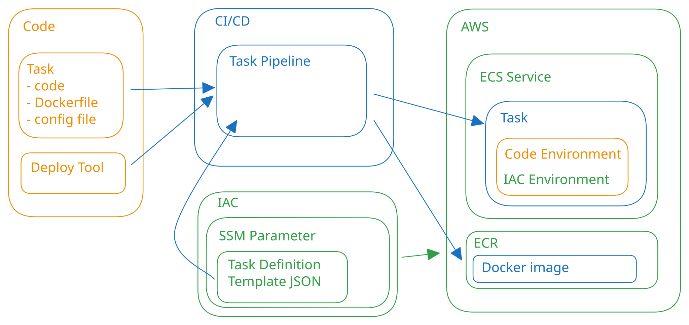

# ECS Deploy CLI

Use this tool to deploy a Docker image to ECR and ECS with CI or manually.

Features:

- Environment and SSM credentials storage conventions
- GitHub Actions pipeline example
- Cross-platform (made with TypeScript/Javascript, external requirements: `git`, `docker`)


Examples:

- [NestJs](./examples/nestjs) Docker and Pipeline

# Usage

```bash
yarn add @povio/ecs-deploy-cli
```

## Configure

### .config/${STAGE}.ecs-deploy.yaml
```yaml
accountId: "000000000000"
region: us-east-1
taskFamily: myapp-dev-backend
serviceName: myapp-dev-backend
clusterName: myapp-dev

# build and upload to ecr with `ecs-deploy build backend --stage dev`
build:
  - name: backend
    repoName: myapp-backend
    #context: ./test
    #dockerfile: Dockerfile
    platform: linux/amd64

    environmentValues:
      # resolved at build time
      - name: RELEASE
        valueFrom: "func:release"
      - name: BUILD_TIMESTAMP
        valueFrom: "func:timestamp"
      - name: BUILD_ENV_VAR_1
        value: "static value"

# deploy to ecs with `ecs-deploy deploy --stage dev`
taskDefinition:
  - name: default
    # resolved at deploy time, requires SSM access
    template: arn:aws:ssm:::parameter/myapp-dev/backend/task-definition
    containerDefinitions:
      - name: backend
        # name of build above or any other docker path
        image: backend

        # inserted into task definition and resolved at deploy time
        environmentValues:
          - name: DEPLOY_TIMESTAMP
            valueFrom: "func:timestamp"
          - name: TASK_ENV_VAR_1
            value: "static value"

        # inserted into task definition and resolved at task init
        secrets:
          STAGE2: arn:aws:ssm:::parameter/myapp-dev/backend/task-definition

# resolved at runtime using `ecs-deploy config backend --stage dev`
configs:
  - name: backend
    destination: ./.config/myapp-dev.backend.yml

    # optional template, to diff the resolved data from
    template:

    values:
        # load config from ./.config/${stage}.backend.template.yml
        # and interpolate ${arn:aws:ssm..} and ${env:ENV_VALUE} values
        # load them onto the root
      - name: "@"
        configFrom: backend.template

      - name: "@"
        configFrom: backend.override
        optional: true

        # simple value mapping
      - name: database__password
        valueFrom: arn:aws:ssm:::parameter/myapp-dev/database/password

        # JSON object mapping
      - name: database
        valueFrom: arn:aws:ssm:::parameter/myapp-dev/database

      - name: database__host
        valueFrom: env:DATABASE_HOST
```

### Example

Where `configFrom: backend.template` and the config file is `.config/${stage}.backend.template.yml`:

```yaml
stage: ${func:stage}
release: ${func:release}
database:
  username: myapp2
  password: ${arn:aws:ssm:::parameter/myapp-dev/database/password}
  debug: ${env:DEBUG}
```

the output will be at the set destination, for example `./.config/myapp-dev.backend.yml`:

```yaml
database:
  username: myapp2
  password: the-password-from-ssm
  debug: the-value-from-the-environment
```


## Run

```bash
yarn ecs-deploy --help

# Build a new image from the current git commit and push to ECR
yarn ecs-deploy build <name> --stage my-stage

# Push an existing image to ECR (tag of image needs to be the same as RELEASE or the git commit hash )
# yarn ecs-deploy push <name> --stage my-stage

# Deploy the task definition to ECS
yarn ecs-deploy deploy [name] --stage my-stage

# Deploy and clean up old unused image tags older than 30 days
yarn ecs-deploy deploy [name] --stage my-stage --untagUnused --days 30

# Generate a config script
yarn ecs-deploy bootstrap [name] --stage my-stage
```
## Run Options

Descriptions for useful flags. Use `--help` for a comprehensive list.

#### --ignoreGitChanges

Use this flag while debugging the build. This might have unintended consequences - never deploy a build made using this flag. (build only)

#### --skipEcrExistsCheck

Speed up builds if you know the ECR image does not exist. (build only)

#### --skipPush

Only build the image. Useful for testing.

#### --buildx

Use [docker buildx](https://docs.docker.com/buildx/working-with-buildx/) to build on ARM / Apple M1.

#### --watch

In CI, wait for ecs-deploy to complete. This could take a while so set a timeout on the CI.
#### --untagUnused

Clean up old unused image tags from ECR repositories after deployment. This will remove tags that are older than the specified number of days (default: 30) while preserving the currently deployed image and the newly deployed image.

#### --days

Specify the number of days to keep image tags when using `--untagUnused`. Tags older than this number of days will be removed (default: 30).

#### --untagPrefix

Only untag images whose tags start with this prefix. Providing this argument overrides `build.prefix` property in config.

#### ecr-untag

Standalone command to untag images.

## Required AWS IAM Permissions

To use all features of this CLI (build, push, deploy, untag, describe, etc.), your IAM user/role needs the following permissions:

```json
{
  "Version": "2012-10-17",
  "Statement": [
    {
      "Effect": "Allow",
      "Action": [
        "ecr:GetAuthorizationToken",
        "ecr:BatchCheckLayerAvailability",
        "ecr:GetDownloadUrlForLayer",
        "ecr:GetRepositoryPolicy",
        "ecr:DescribeRepositories",
        "ecr:ListImages",
        "ecr:DescribeImages",
        "ecr:BatchGetImage",
        "ecr:InitiateLayerUpload",
        "ecr:UploadLayerPart",
        "ecr:CompleteLayerUpload",
        "ecr:PutImage",
        "ecr:BatchDeleteImage",
        "ecs:DescribeServices",
        "ecs:UpdateService",
        "ecs:DescribeTaskDefinition",
        "ecs:RegisterTaskDefinition",
        "ecs:ListTasks",
        "ecs:DescribeTasks"
      ],
      "Resource": "*"
    },
    {
      "Effect": "Allow",
      "Action": [
        "ssm:GetParameter",
        "ssm:GetParameters",
        "ssm:GetParametersByPath"
      ],
      "Resource": "*"
    }
  ]
}
```

**Notes:**
- You may scope `Resource` to specific ARNs for tighter security.
- If you use SSM for secrets or task definitions, SSM permissions are required.

## How it works

The build script builds and pushes a Docker image to ECR.

The deploy script generates a ECS task definition using a template stored on SSM and deploys it to ECS.

The bootstrap script generates a config script with resolved values from SSM and environment variables.



## Development

### Test locally

Set up `./test/.config/myapp-dev.ecs-deploy.yml` with credentials to do a E2E test.

```bash
# alias for `ecs-deploy` while developing
yarn start build backend --cwd ./test --stage myapp-dev

yarn start bootstrap --stage myapp-dev --verbose --pwd ./test

yarn test:watch
```

### Release

Set new version in `package.json`.

```bash
yarn build
```
